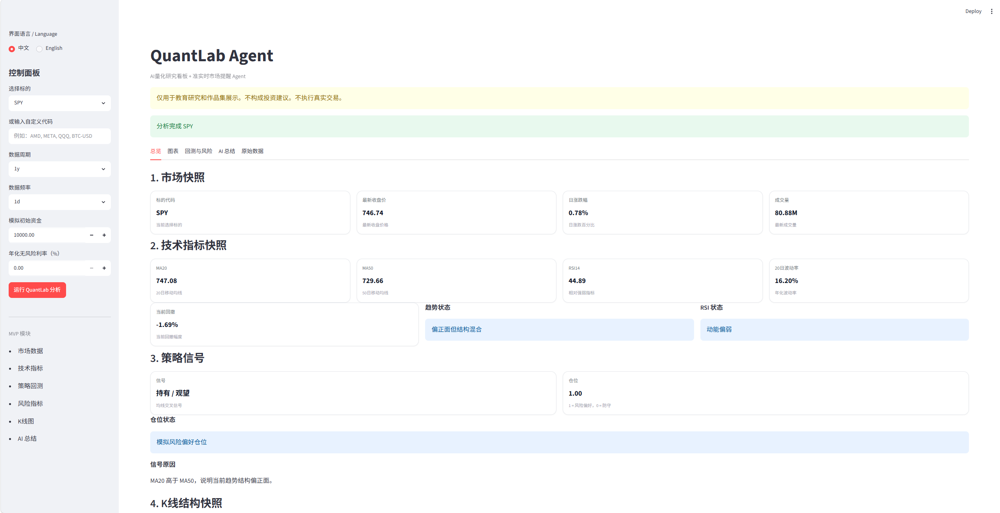
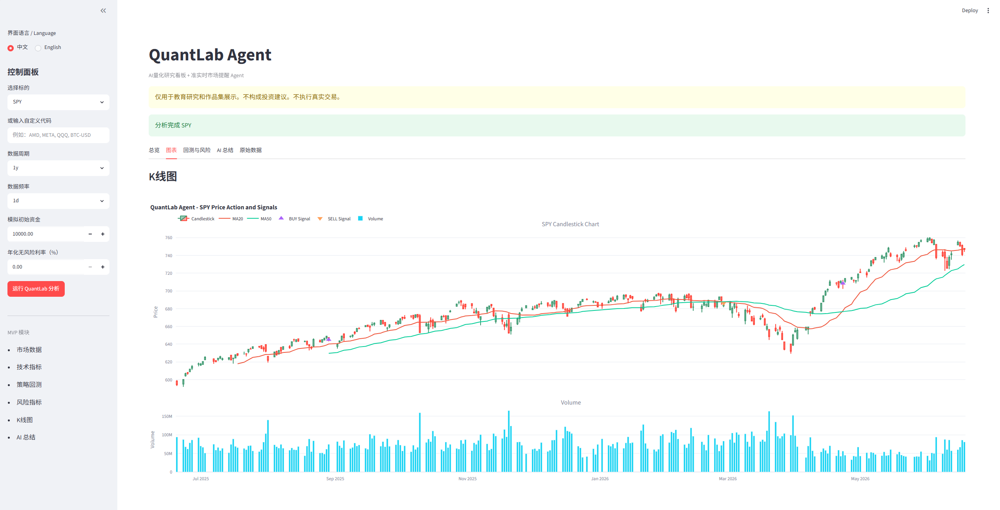
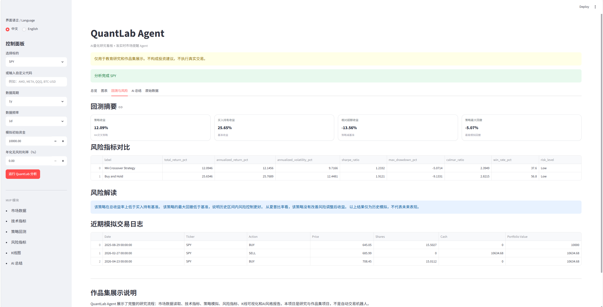
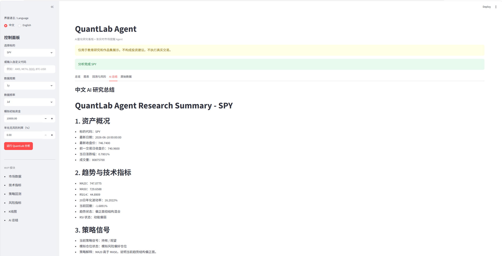
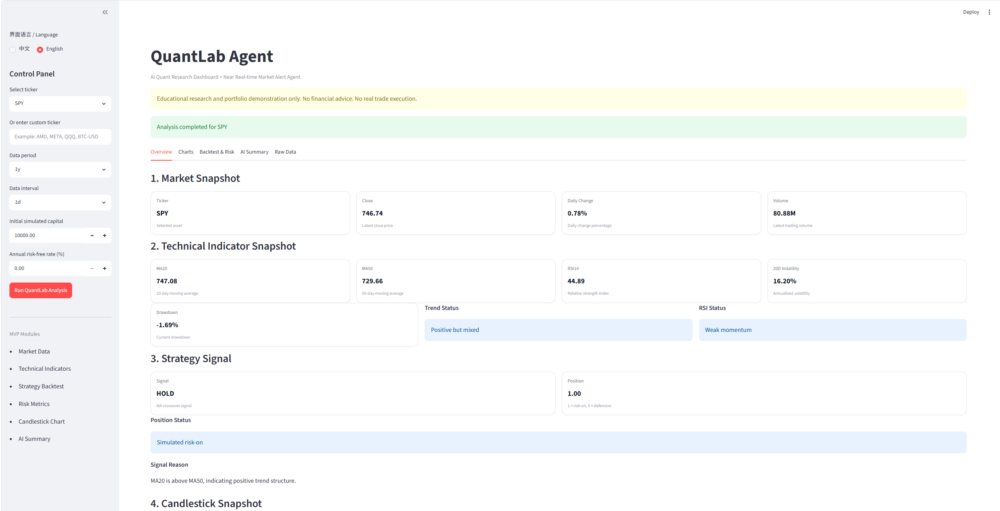
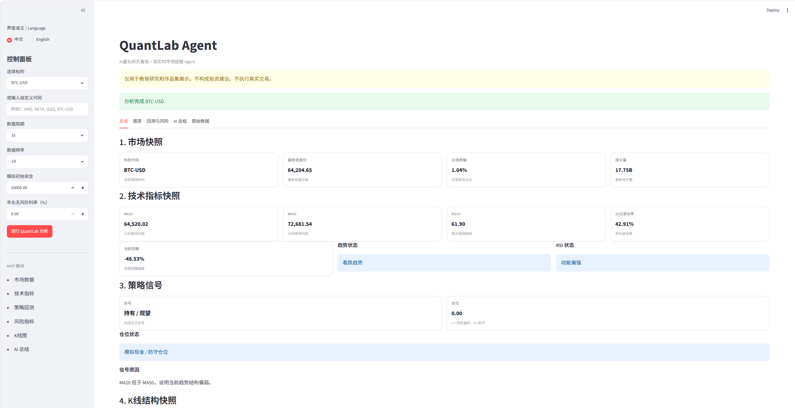

# QuantLab Agent

AI Quant Research Dashboard + Bilingual Market Analysis Agent

QuantLab Agent is a portfolio-grade AI quant research dashboard built with Python and Streamlit.

It combines market data loading, technical indicators, strategy backtesting, risk metrics, candlestick visualization, and AI-style research summaries into one interactive dashboard.

This project is designed for educational research, strategy simulation, and portfolio demonstration. It does not execute real trades and does not provide financial advice.

---

## Project Positioning

QuantLab Agent is not a trading bot.

It is an AI-assisted quant research and market analysis dashboard that demonstrates:

- Financial data analysis（金融数据分析）
- Quantitative strategy thinking（量化策略思维）
- Technical indicator calculation（技术指标计算）
- Strategy backtesting（策略回测）
- Risk-aware product design（风险意识产品设计）
- Candlestick chart visualization（K线图可视化）
- AI-style Chinese research reporting（AI风格中文研究总结）
- Bilingual dashboard UI（中英文双语界面）
- Streamlit web product development（Streamlit网页产品开发）

---

## Core Features

### 1. Market Data Loading（市场数据读取）

- Supports stocks, ETFs, and crypto-style tickers
- Example tickers: SPY, QQQ, AAPL, MSFT, NVDA, TSLA, BTC-USD, ETH-USD
- Uses yfinance as the MVP data source

### 2. Technical Indicators（技术指标）

- Daily return
- Cumulative return
- MA20
- MA50
- RSI14
- 20-day annualized volatility
- Drawdown
- Trend status
- RSI status

### 3. Strategy Signal（策略信号）

- MA20 / MA50 crossover logic
- BUY / SELL / HOLD research signals
- Simulated risk-on / defensive position status
- Strategy explanation

### 4. Backtesting（回测）

- MA crossover strategy backtest
- Buy and Hold benchmark comparison
- Strategy equity curve
- Buy and Hold equity curve
- Simulated trade log

### 5. Risk Metrics（风险指标）

- Total return
- Annualized return
- Annualized volatility
- Sharpe ratio
- Maximum drawdown
- Calmar ratio
- Win rate
- Risk level classification

### 6. Candlestick Chart（K线图）

- Interactive candlestick chart
- MA20 / MA50 overlay
- Volume chart
- Buy / Sell signal markers
- Latest candle structure observation

### 7. AI-style Research Summary（AI风格研究总结）

- Chinese structured research summary
- Asset overview
- Technical indicator explanation
- Strategy signal explanation
- Backtest summary
- Risk interpretation
- Candlestick observation
- Disclaimer

### 8. Bilingual UI（中英文双语界面）

- Default language: 中文
- Optional language: English
- English technical terms with Chinese explanations
- Stable language switching without resetting user inputs

---

## Dashboard Preview

Recommended screenshot pack:

| Screenshot | Description |
|---|---|
| 01_cn_overview_spy.png | Chinese dashboard overview |
| 02_candlestick_chart_spy.png | Candlestick chart with MA and volume |
| 03_backtest_risk_spy.png | Backtest and risk metrics |
| 04_ai_summary_spy.png | Chinese AI research summary |
| 05_english_overview_spy.png | English dashboard interface |
| 06_btc_overview_cn.png | BTC-USD multi-asset example |

Screenshot planning document:

portfolio/showcase_notes/SCREENSHOT_PLAN.md

Screenshot folder:

portfolio/showcase_screenshots/

---

---

## Dashboard Screenshots

### 1. Chinese Dashboard Overview（中文总览页）

### 2. Candlestick Chart（K线图）

### 3. Backtest and Risk Metrics（回测与风险指标）

### 4. AI Research Summary（AI研究总结）

### 5. English Interface（英文界面）

### 6. BTC-USD Example（BTC-USD 多资产示例）

## Demo Flow

### Step 1: Start the Dashboard

Run:

streamlit run app.py

Open:

http://localhost:8501

### Step 2: Run Chinese Dashboard Demo

Recommended settings:

- Language: 中文
- Ticker: SPY
- Period: 1y
- Interval: 1d
- Initial capital: 10000
- Risk-free rate: 0

Click:

运行 QuantLab 分析

### Step 3: Review Dashboard Tabs

- 总览 / Overview
- 图表 / Charts
- 回测与风险 / Backtest & Risk
- AI 总结 / AI Summary
- 原始数据 / Raw Data

### Step 4: Test Multi-Asset Support

Recommended tickers:

- SPY
- AAPL
- BTC-USD

---

## Project Structure

QuantLabAgent/
- app.py
- run_agent.py
- requirements.txt
- README.md
- .gitignore
- .env.example
- config/settings.json
- data/sample_tickers.csv
- docs/
- modules/
- outputs/
- portfolio/
- tests/

Main modules:

- modules/data_loader.py
- modules/indicators.py
- modules/strategies.py
- modules/backtester.py
- modules/risk_metrics.py
- modules/candlestick_analyzer.py
- modules/chart_builder.py
- modules/ai_summary.py

---

## Tech Stack

- Python
- Streamlit
- pandas
- NumPy
- yfinance
- Plotly
- Matplotlib
- python-dotenv
- pytest

Optional / future:

- Telegram Bot API
- OpenAI API
- Real-time market data API
- Cloud deployment

---

## How to Run Locally

### 1. Create virtual environment

python -m venv .venv

### 2. Activate virtual environment

Windows PowerShell:

.\.venv\Scripts\Activate.ps1

### 3. Install dependencies

pip install -r requirements.txt

### 4. Run dashboard

streamlit run app.py

---

## Current MVP Status

Current checkpoint:

QUANTLAB-015: Showcase Screenshot Pack + README Polish

Completed modules:

- QUANTLAB-005: Data Loader
- QUANTLAB-006: Indicators
- QUANTLAB-007: Strategy Signal + Backtesting
- QUANTLAB-008: Risk Metrics
- QUANTLAB-009: Candlestick Chart
- QUANTLAB-010: AI Summary
- QUANTLAB-011: Streamlit MVP Dashboard
- QUANTLAB-012: Dashboard Polish
- QUANTLAB-013: UI Card Polish
- QUANTLAB-014: Bilingual UI Toggle
- QUANTLAB-015: Showcase Preparation

---

## Future Roadmap

Potential future modules:

- Daily Momentum Watchlist（每日动量观察池）
- Long-Term Candidate Pool（长期候选池）
- Telegram market alert push（Telegram市场提醒推送）
- ETF rotation analysis（ETF轮动分析）
- News sentiment analysis（新闻情绪分析）
- PDF report export（PDF报告导出）
- Multi-market support（多市场支持）
- Real-time market data integration（实时市场数据接入）
- OpenAI enhanced research writer（OpenAI增强研究总结）

---

## Safety Boundary

QuantLab Agent does not:

- Execute real trades
- Connect to brokerage accounts
- Provide personalized financial advice
- Guarantee returns
- Perform high-frequency trading

All outputs are for educational research, strategy simulation, and portfolio demonstration only.

---

## Disclaimer

This project is for educational, research, and portfolio demonstration purposes only.

Nothing in this project should be interpreted as financial advice, investment recommendation, or trading instruction.

Past performance does not guarantee future results. Backtesting results are based on historical data and may not reflect real market conditions, liquidity constraints, fees, taxes, slippage, or execution risks.
